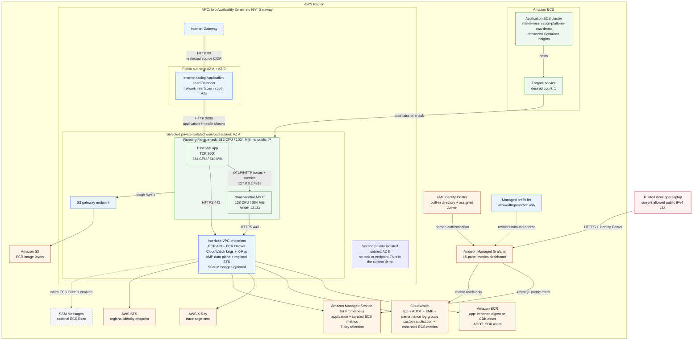

# ECS/Fargate AWS Resource Architecture

This page shows the deployed AWS architecture modeled by `GoldenPathDemoStack`
in `ecs-infra/lib/infra-stack.ts` at two levels:

- the **high-level runtime architecture** shows the major components, placement,
  and communication paths;
- the **detailed resource topology** shows the supporting AWS resources and
  control relationships behind that runtime.

CDK synthesis, deployment, CI, and user workflows are intentionally outside
both diagrams.

## High-Level Runtime Architecture

Use this view to understand where the application runs and how network traffic
reaches it. This is closest to what is usually called an AWS architecture
diagram.



The task definition is deliberately absent here. It configures how ECS creates
a task, but it is not a running component, a network hop, or something placed in
a subnet.

## Detailed AWS Resource Topology

Use this view when reasoning about the CDK and CloudFormation resources,
networking controls, health checks, or IAM relationships. The task definition
belongs here because the ECS service references it to create the running task.

```mermaid
flowchart TB
  subgraph region["AWS Region"]
    direction TB

    subgraph regionalServices["Regional AWS services"]
      direction LR
      ecr["Amazon ECR<br/>imported app repository or CDK asset repository<br/>app + ADOT images"]
      s3["Amazon S3<br/>ECR image layers"]
      cloudwatch["CloudWatch<br/>app + ADOT + EMF + performance log groups<br/>custom application + enhanced ECS metrics<br/>7-day log retention"]
      xray["AWS X-Ray<br/>trace segments"]
      amp["AMP workspace<br/>application + curated ECS metrics<br/>7-day retention"]
      grafana["Managed Grafana workspace<br/>Identity Center authentication<br/>customer-managed permissions"]
      identityCenter["IAM Identity Center<br/>built-in directory<br/>assigned Admin user"]
      sts["Regional AWS STS<br/>collector identity calls"]
      ssm["SSM Messages<br/>ECS Exec channels"]
    end

    subgraph grafanaResources["Managed Grafana access resources"]
      direction LR
      grafanaRole["Customer-managed IAM role<br/>AMP workspace queries<br/>CloudWatch metric reads only"]
      grafanaPrefixList["IPv4 managed prefix list<br/>one allowedIngressCidr entry"]
      dashboardArtifact["Repository dashboard JSON<br/>15 panels<br/>manual import"]

      grafanaRole -.->|"assumed by"| grafana
      grafanaPrefixList -.->|"network access control"| grafana
      dashboardArtifact -.->|"manual import"| grafana
      identityCenter -->|"authenticates assigned user"| grafana
    end

    subgraph ecsResources["Amazon ECS / Fargate resources"]
      direction LR
      cluster["Application ECS cluster<br/>movie-reservation-platform-aws-demo<br/>enhanced Container Insights"]
      service["Fargate service<br/>desired count: 1<br/>deployment rollback enabled<br/>health grace: 60s"]
      taskDefinition["Fargate task definition<br/>512 CPU units / 1024 MiB<br/>essential app + nonessential ADOT<br/>separate awslogs drivers"]
      executionRole["Task execution role<br/>image pull + log delivery"]
      taskRole["Shared task role<br/>X-Ray + scoped EMF writes<br/>workspace-scoped AMP remote write<br/>+ ECS Exec when enabled"]

      cluster -->|"hosts"| service
      taskDefinition -->|"used by"| service
      taskDefinition --> executionRole
      taskDefinition --> taskRole
    end

    subgraph vpc["VPC: two Availability Zones, no NAT Gateway"]
      direction TB
      igw["Internet Gateway"]

      subgraph publicSubnets["Public subnets /24: AZ A + AZ B"]
        direction LR
        publicRoute["Public route table<br/>0.0.0.0/0 to IGW"]
        alb["Internet-facing Application Load Balancer<br/>attached to both public subnets"]
        listener["HTTP listener<br/>port 80"]
        targetGroup["IP target group<br/>HTTP port 3000<br/>health: GET /health every 30s<br/>deregistration delay: 30s"]

        publicRoute --> igw
        alb --> listener --> targetGroup
      end

      subgraph workloadSubnet["Selected private isolated workload subnet /24: AZ A"]
        direction TB
        isolatedRoute["Isolated route table<br/>VPC-local routes"]
        task["Fargate task ENI<br/>app TCP 3000<br/>ADOT loopback 4318/13133"]

        subgraph endpointEnis["Private AWS-service access"]
          direction LR
          ecrApiEndpoint["ECR API<br/>interface endpoint"]
          ecrDockerEndpoint["ECR Docker<br/>interface endpoint"]
          logsEndpoint["CloudWatch Logs<br/>interface endpoint"]
          xrayEndpoint["X-Ray<br/>interface endpoint<br/>write-only policy"]
          ampEndpoint["AMP workspaces<br/>interface endpoint<br/>remote-write-only policy"]
          stsEndpoint["Regional STS<br/>interface endpoint<br/>identity-only policy"]
          s3Endpoint["S3<br/>gateway endpoint"]
          ssmEndpoint["SSM Messages<br/>interface endpoint<br/>optional"]
        end

        isolatedRoute -->|"S3 prefix-list route"| s3Endpoint
        task -->|"HTTPS 443<br/>auth + metadata"| ecrApiEndpoint
        task -->|"HTTPS 443<br/>image manifest"| ecrDockerEndpoint
        task -->|"image layers"| s3Endpoint
        task -->|"HTTPS 443<br/>app/ADOT logs + EMF events"| logsEndpoint
        task -->|"HTTPS 443<br/>trace writes"| xrayEndpoint
        task -->|"HTTPS 443<br/>Prometheus remote write"| ampEndpoint
        task -->|"HTTPS 443<br/>SigV4 identity"| stsEndpoint
        task -.->|"HTTPS 443<br/>enableEcsExec=true"| ssmEndpoint
      end

      standbySubnet["Second private isolated subnet /24: AZ B<br/>created for symmetric VPC topology<br/>unused by current workloads and endpoints"]

      subgraph securityGroups["Security groups"]
        direction LR
        albSg["ALB security group<br/>ingress TCP 80<br/>from allowedIngressCidr"]
        serviceSg["Service security group<br/>ingress TCP 3000<br/>from ALB security group"]
        endpointSg["Endpoint security group<br/>ingress TCP 443<br/>from service security group"]
      end

      igw -->|"HTTP 80"| alb
      targetGroup -->|"application traffic<br/>+ health checks"| task

      albSg -. "attached to" .-> alb
      serviceSg -. "attached to" .-> task
      endpointSg -. "attached to" .-> ecrApiEndpoint
      endpointSg -. "attached to" .-> ecrDockerEndpoint
      endpointSg -. "attached to" .-> logsEndpoint
      endpointSg -. "attached to" .-> xrayEndpoint
      endpointSg -. "attached to" .-> ampEndpoint
      endpointSg -. "attached to" .-> stsEndpoint
      endpointSg -. "attached when enabled" .-> ssmEndpoint
    end

    service -->|"runs and replaces task<br/>min 100% / max 200%"| task
    taskDefinition -->|"defines container"| task

    ecrApiEndpoint --> ecr
    ecrDockerEndpoint --> ecr
    s3Endpoint --> s3
    logsEndpoint --> cloudwatch
    xrayEndpoint --> xray
    ampEndpoint --> amp
    stsEndpoint --> sts
    ssmEndpoint -.-> ssm

    executionRole -. "permits image pull" .-> ecr
    executionRole -. "permits log writes" .-> cloudwatch
    taskRole -. "permits Exec when enabled" .-> ssm
    taskRole -. "permits two write actions" .-> xray
    taskRole -. "permits stream + event writes<br/>to named EMF log group" .-> cloudwatch
    taskRole -. "permits remote write<br/>to one workspace" .-> amp
    grafanaRole -. "permits read queries<br/>to one workspace" .-> amp
    grafanaRole -. "permits metric query/list only" .-> cloudwatch
  end

  trustedLaptop["Trusted developer laptop<br/>current allowed public IPv4 /32"]
  trustedLaptop -->|"HTTPS + Identity Center"| grafana

  classDef network fill:#eaf4ff,stroke:#2563eb,color:#111827
  classDef compute fill:#edf7ed,stroke:#238636,color:#111827
  classDef awsService fill:#fff4e5,stroke:#c2410c,color:#111827
  classDef security fill:#fff1f2,stroke:#be123c,color:#111827
  classDef optional fill:#f5f5f5,stroke:#6b7280,color:#111827,stroke-dasharray: 5 5

  class igw,publicRoute,alb,listener,targetGroup,isolatedRoute,ecrApiEndpoint,ecrDockerEndpoint,logsEndpoint,xrayEndpoint,ampEndpoint,stsEndpoint,s3Endpoint,grafanaPrefixList network
  class cluster,service,taskDefinition,executionRole,taskRole,task compute
  class ecr,s3,cloudwatch,xray,amp,grafana,identityCenter,sts,ssm awsService
  class albSg,serviceSg,endpointSg,grafanaRole,trustedLaptop security
  class ssmEndpoint optional
```



## Application Image Deployment Contract

`GoldenPathDemoStack` consumes one resolved application image and one service
version. Everything after that boundary—the task definition, container name and
port, health check, environment, logging, telemetry, ALB target, and deployment
settings—is identical in both modes.

| Mode | Application image source | `SERVICE_VERSION` source | Repository lifecycle |
| --- | --- | --- | --- |
| `local-docker-asset` (default) | CDK hashes the repository Docker context and models an `AppImage` Docker asset | `movie-reservation-service/package.json` | CDK publishes the app asset to its bootstrap ECR repository during deployment |
| `ecr-image` | CDK imports an existing private ECR repository and selects an exact `sha256` digest | Required opaque `applicationServiceVersion` context | Platform foundation owns the repository; the workload stack neither creates nor deletes it |

ECR mode requires both context values:

```text
applicationImageReference=<account>.dkr.ecr.<region>.amazonaws.com/<repository>@sha256:<64-hex-digest>
applicationServiceVersion=<opaque-release-identifier>
```

The registry account and Region must exactly match the concrete CDK deployment
target. Validation is offline: synthesis checks the contract but does not call
ECR or prove the repository or digest exists. The imported repository therefore
does not synthesize an `AWS::ECR::Repository` resource.

`ecs.ContainerImage.fromEcrRepository` grants pull access to the ECS task
**execution role**, which is the AWS identity used by the ECS agent before the
containers start. The application **task role** receives no ECR permissions;
that role is reserved for AWS API calls made by the running app and ADOT
containers. In both modes, the repository-owned ADOT image remains a separate
CDK Docker asset built from `ecs-infra/adot-collector`.

The durable publication, promotion, repository-ownership, and teardown decision
is recorded in
[ADR 022](architecture-decisions.md#adr-022-deploy-immutable-service-artifacts-by-digest).

## Main Boundaries

- **Public ingress:** the Internet Gateway and public route make the ALB
  internet-facing. Its security group still restricts port 80 to
  `allowedIngressCidr`, and the config boundary rejects `0.0.0.0/0` as an
  ingress value. The public route table's `0.0.0.0/0 -> Internet Gateway` route
  is different: it makes the public subnet internet-routable, but it does not
  itself authorize inbound connections through the ALB security group.
- **Grafana human access:** Managed Grafana is a regional managed service, not
  a workload inside this VPC. Its network access control references a
  stack-owned managed prefix list containing the same `allowedIngressCidr`.
  IAM Identity Center authenticates the human and the Grafana workspace
  assignment authorizes that user; both checks remain required.
- **Private compute:** the Fargate task receives an ENI in the isolated subnet,
  has no public IP, and accepts port 3000 only from the ALB security group.
- **Availability Zone split:** the VPC and internet-facing ALB span two
  Availability Zones. The demo task, S3 endpoint route, and interface endpoint
  ENIs are explicitly pinned to one workload subnet to avoid paying for a
  duplicate endpoint set before high availability is required. Target-group
  ALB cross-zone load balancing is explicitly enabled so both nodes can route
  to the healthy target in the selected workload AZ.
- **No-NAT service access:** ECR API, ECR Docker, CloudWatch Logs, X-Ray, the
  AMP workspace data plane, regional STS, and optional SSM Messages use
  interface endpoint ENIs. ECR image layers use the S3 gateway endpoint
  attached only to the selected workload subnet's route table. There is no AMP
  control-plane endpoint because the running task only writes metrics. This
  path is the same whether the app image came from the CDK bootstrap repository
  or an imported same-account, same-Region ECR repository.
- **ECS control resources:** the cluster, service, task definition, and IAM roles
  are regional resources. The running Fargate task is the part placed in the
  selected VPC subnet.
- **ECS Exec:** enabling Exec adds the SSM Messages endpoint and grants the task
  role permission to open control and data channels. The operator invoking
  `execute-command` still needs separate identity-side IAM permission.
- **Health and deployment:** the target group calls `GET /health` every 30
  seconds. The ECS service keeps one desired task, gives startup a 60-second
  grace period, and rolls back failed deployments. ADOT has its own non-gating
  `/healthcheck` command and restart policy; collector failure does not make the
  app container or task unhealthy.
- **Telemetry boundary:** the application emits standard OTLP and W3C context.
  ADOT owns AWS credentials, X-Ray translation, CloudWatch dimension shaping,
  EMF publication, AMP label shaping, and SigV4 remote write. There are no task
  security group rules for ports 4318 or 13133 because both listeners use task
  loopback. EMF uses the existing CloudWatch Logs endpoint rather than a
  CloudWatch Metrics endpoint.
- **Application metrics:** the Node.js SDK exports every 30 seconds by default,
  and typed CDK context can set an integer cadence from 5 through 300 seconds.
  ADOT disables automatic dimension rollups and exports only the ten declared
  instruments under
  `GoldenPath/aws-demo/movie-reservation-service`. `ServiceName`,
  `Environment`, and metric-specific bounded attributes form the only
  CloudWatch dimensions. The same application stream is sent to AMP with only
  the stable `service_name`, `deployment_environment`, and instrument
  attributes as labels. The pipeline removes `service.instance.id` and disables
  generated target/scope metadata so per-process identity cannot re-enter the
  Prometheus series implicitly.
- **ECS metrics:** ADOT exports only eight task/container CPU and memory
  reserved/utilized metrics to AMP. It preserves cluster, service, task family,
  container name, and Region while deleting task/container identities, image
  identity, timestamps, and other churn before resource-to-label conversion.
  Enhanced Container Insights independently supplies the AWS-native
  task/container view in CloudWatch.
- **Grafana data access:** the Grafana service assumes a customer-managed IAM
  role whose trust is limited by the current account and same-account Grafana
  workspace ARN pattern. That role can query the one AMP workspace and use only
  CloudWatch metric discovery/query plus Region discovery. It has no Logs,
  X-Ray, alarm, notification, or write permissions.
- **Dashboard ownership:** CDK creates the AWS workspace, role, prefix list, and
  outputs. The repository owns the 15-panel JSON artifact. Identity Center user
  assignment, data-source configuration, and dashboard import remain manual,
  so no API token or second infrastructure state owner is introduced.
- **Trace privacy:** the X-Ray exporter keeps `index_all_attributes: false` and
  configures no indexed attributes. The current `enduser.id` span attribute is
  nevertheless stable/linkable and maps to X-Ray's dedicated `user` field; the
  indexing setting does not anonymize it. The ECS demo currently uses a fixed
  fake user. Before production auth, revisit whether traces need this field and
  prefer a keyed HMAC/pseudonym over a plain enumerable hash when they do.

Known telemetry debt is tracked in
[`platform-follow-up-tasks.md`](../plans/platform-follow-up-tasks.md#telemetry-platform-debt).
The sidecar is intentionally a first ECS proof, not a golden path to stamp onto
every future service. The app also intentionally fails open when telemetry is
unavailable, so platform readiness must stay separate from telemetry-delivery
health. That means a broken collector can leave the service running while traces
or metrics are missing until a later telemetry-path alerting slice exists.

Both diagrams show the fixed demo compromise represented by `PlatformConfig`:
`vpcMaxAzs` is `2`, while `workloadAzCount` is `1`. These values are not exposed
through CDK context. Security groups use CDK's default outbound allowance; the
rules shown above are the explicit inbound rules.

The cluster construct ID is `ApplicationCluster`, and its physical name is
`movie-reservation-platform-aws-demo`. The cluster is named for the platform and
environment because it can later host multiple independently deployed ECS
services. Service-owned resources such as the ECS service, task-definition
family, and log groups retain the `movie-reservation-service` identity. The
`workload` subnet name remains role-based so it can host task and endpoint ENIs
for more than one application service. `Project`, `Platform`, and `Environment`
tags apply across the stack, while the `Service` tag is limited to
service-owned compute, ingress, and logging resources.
