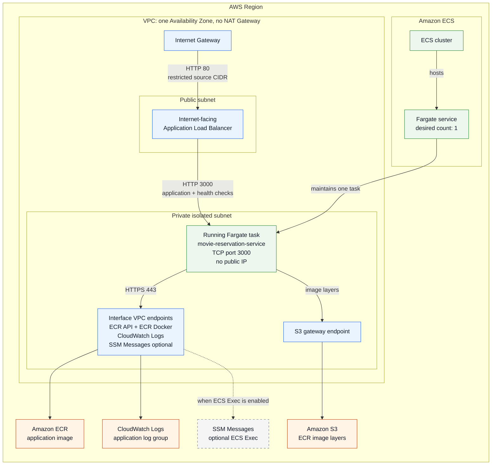
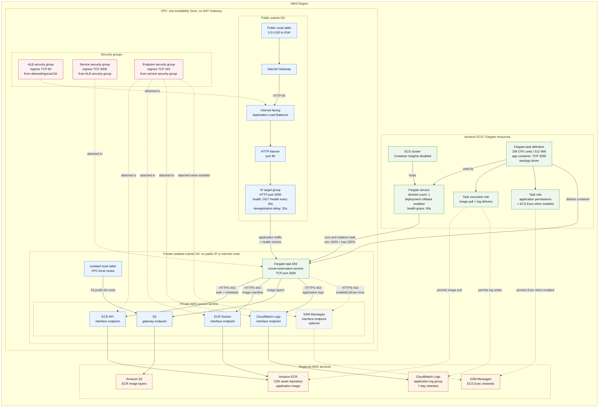

# ECS/Fargate AWS Resource Architecture

This page shows the deployed AWS architecture modeled by `GoldenPathDemoStack`
in `ecs-infra/lib/infra-stack.ts` at two levels:

- the **high-level runtime architecture** shows the major components, placement,
  and communication paths;
- the **detailed resource topology** shows the supporting AWS resources and
  control relationships behind that runtime.

CDK synthesis, deployment, CI, and user workflows are intentionally outside
both diagrams.

## High-Level Runtime Architecture

Use this view to understand where the application runs and how network traffic
reaches it. This is closest to what is usually called an AWS architecture
diagram.

The task definition is deliberately absent here. It configures how ECS creates
a task, but it is not a running component, a network hop, or something placed in
a subnet.

## Detailed AWS Resource Topology

Use this view when reasoning about the CDK and CloudFormation resources,
networking controls, health checks, or IAM relationships. The task definition
belongs here because the ECS service references it to create the running task.

## Main Boundaries

- **Public ingress:** the Internet Gateway and public route make the ALB
  internet-facing. Its security group still restricts port 80 to
  `allowedIngressCidr`.
- **Private compute:** the Fargate task receives an ENI in the isolated subnet,
  has no public IP, and accepts port 3000 only from the ALB security group.
- **No-NAT service access:** ECR API, ECR Docker, CloudWatch Logs, and optional
  SSM Messages use interface endpoint ENIs. ECR image layers use the S3 gateway
  endpoint attached to the isolated route table.
- **ECS control resources:** the cluster, service, task definition, and IAM roles
  are regional resources. The running Fargate task is the part placed in the
  selected VPC subnet.
- **Health and deployment:** the target group calls `GET /health` every 30
  seconds. The ECS service keeps one desired task, gives startup a 60-second
  grace period, and rolls back failed deployments.

Both diagrams show one public and one isolated subnet because the current
`PlatformConfig` fixes `maxAzs` to `1`. Security groups use CDK's default
outbound allowance; the rules shown above are the explicit inbound rules.
